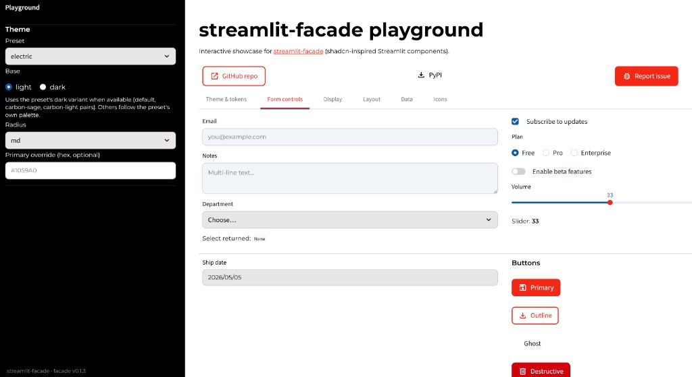

# streamlit-facade playground

Interactive showcase for [**streamlit-facade**](https://github.com/itsdaniyalm/streamlit-facade): shadcn-inspired UI components for [Streamlit](https://streamlit.io/). Fork this app or run it locally to explore presets and widgets before using them in your own dashboards.

## Preview

The **Playground** sidebar drives façade themes (preset, light/dark base, radius, optional primary hex). The main area uses tabs—here **Form controls**—to demo inputs, selects, dates, checkbox/radio/switch/slider, and button variants, plus GitHub / PyPI / issue shortcuts in the header.



## What you get

- **Theme & tokens** — Presets, light/dark base, radius, and optional primary color override (sidebar).
- **Tabs** — Theme & tokens, Form controls, Display, Layout, Data, and Icons mirror common façade demos.
- **Custom preset** — The **electric** preset in this repo extends the library with brand-aligned tokens (see `app.py`).

Upstream library: [GitHub](https://github.com/itsdaniyalm/streamlit-facade) · [PyPI](https://pypi.org/project/streamlit-facade/)

## Run locally

Python 3.10+ recommended.

```bash
python -m venv .venv
.venv\Scripts\activate          # Windows
# source .venv/bin/activate     # macOS / Linux

pip install -r requirements.txt
streamlit run app.py
```

The app reads Streamlit config from `.streamlit/config.toml` when present.

## Live app

The app is hosted at [aifab-facade.streamlit.app](https://aifab-facade.streamlit.app/).
